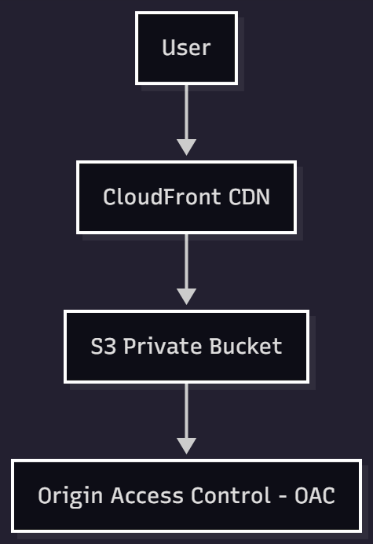

# Static Website Hosting using CloudFront

## Overview
Hosted a secure and high-performance static website utilizing AWS global edge network.

## Architecture Diagram

## Responsibilities
- Enabled static hosting on S3 Bucket
- Configured CloudFront Distribution with OAC security
- Used ACM SSL Certificate for HTTPS
- Integrated Route 53 for custom domain routing
- Enforced IAM + MFA for secure access

## Outcome
- Reduced global load time by 40–60% using CDN caching
- Enhanced data security by blocking public bucket access
